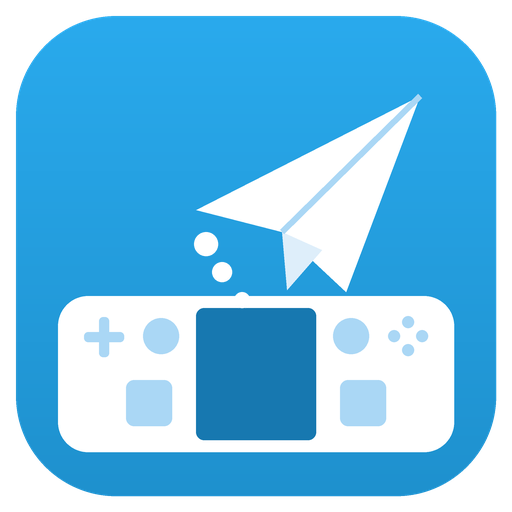
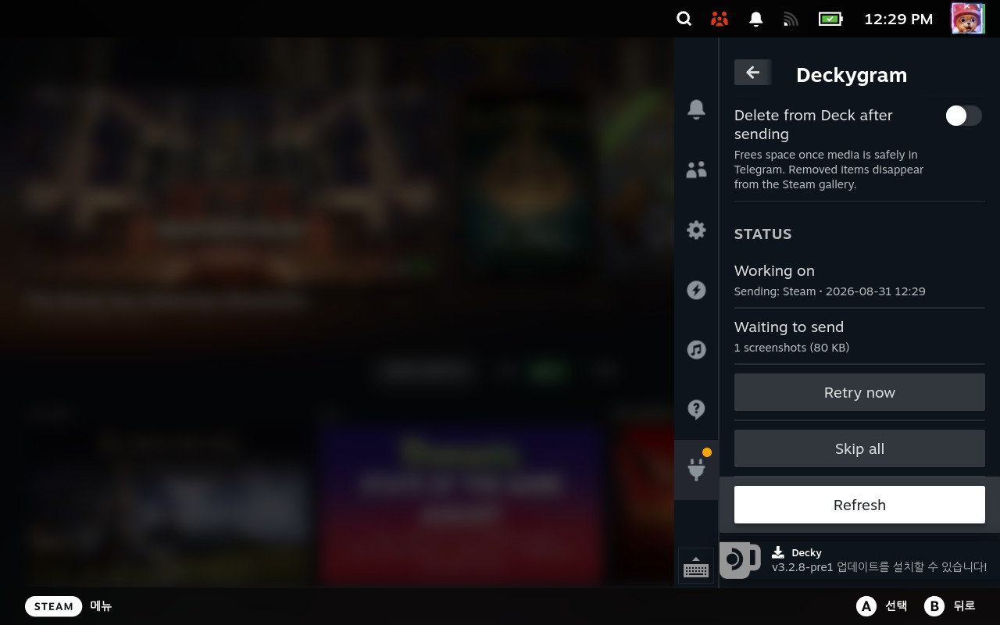
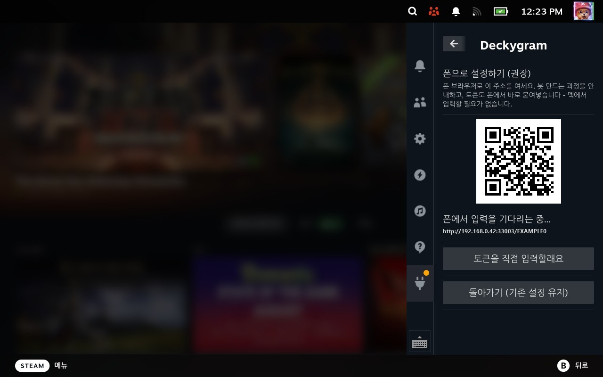
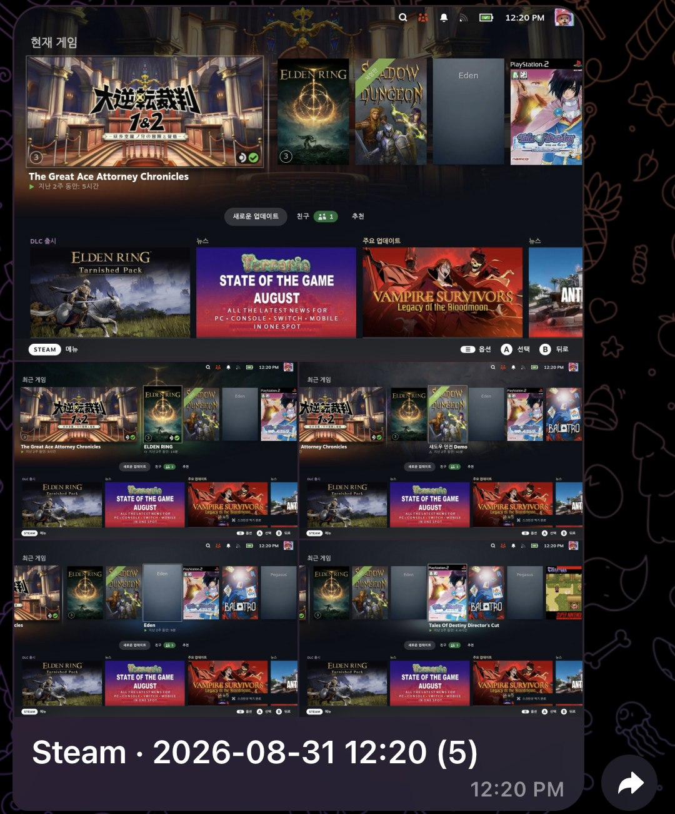

<div align="center">



# Deckygram

**Steam Deck screenshots & clips → your Telegram, instantly.**
**스팀덱 스크린샷과 클립을 찍는 순간 텔레그램으로.**

[](https://github.com/novasound6945/deckygram/releases/latest)
[](https://github.com/novasound6945/deckygram/actions)
[](LICENSE)
[](https://decky.xyz)

🇺🇸 [English](#english) · 🇰🇷 [한국어](#한국어)

<table><tr>
<td></td>
<td></td>
<td></td>
</tr><tr>
<td align="center"><sub>Quick Access panel / 퀵 액세스 패널</sub></td>
<td align="center"><sub>QR pairing — scan with your phone / 폰으로 찍는 QR 페어링</sub></td>
<td align="center"><sub>…and they arrive as an album / 앨범으로 도착!</sub></td>
</tr></table>

<sub>UI follows your Steam language — shown here in English and 한국어.</sub>

</div>

---

## English

### ✨ What it does

| | |
|---|---|
| ⚡ **Instant** | A screenshot reaches your phone seconds after you press the button — inotify, not polling. |
| 🎮 **Game-aware captions** | Every photo arrives titled with the game's name — Steam games, non-Steam shortcuts (emulators!), even uninstalled ones. |
| 🎬 **Clips without exporting** | Steam's recorded clips are picked up automatically and remuxed losslessly — no manual export step. |
| 🪶 **Light on your game** | Video is compressed on the Deck's hardware H.265 encoder (~7 % CPU). Temp files stay off the RAM-backed `/tmp`. |
| 🔒 **No cloud, no account** | Media goes straight from your Deck to **your own** Telegram bot. Nothing in between. |
| 📵 **Offline-safe** | Taken offline? Queued and delivered automatically when you're back online. |
| 🧹 **Optional cleanup** | Sent media can be deleted from the Deck to free space. |

### 📦 Install

**Easiest — install from URL.** In Decky settings ⚙️ enable
**Developer mode**, then **Developer → Install plugin from URL** and
paste this (it always points at the newest release):

```
https://github.com/novasound6945/deckygram/releases/latest/download/Deckygram.zip
```

**Or from a ZIP file** — then **Developer → Install plugin from ZIP file**:

> 📥 **Download: [Latest release →](https://github.com/novasound6945/deckygram/releases/latest)** (`Deckygram-vX.Y.Z.zip`)
<sub>(or unpack it into `~/homebrew/plugins/` and restart Decky Loader)</sub>

Then open **Deckygram** in the Quick Access menu (…) — the setup wizard
takes it from there.

### 📱 Setup — bring your phone

No typing on the Deck. The wizard shows a **QR code**:

1. Scan it with your phone — a small page opens on your local network.
2. It walks you through creating a bot with **@BotFather**
   (display name = anything; username must be unique and end in `bot`).
3. Paste the token **on your phone**, tap your bot, press **START**.
4. The Deck finishes by itself. Take a screenshot — it's on your phone.

Only media captured **while sending is ON** is sent. Your existing
gallery is never touched.

### ⚙️ Good to know

- **Requirements**: a Steam Deck on stock SteamOS — nothing to install
  separately. Clips are picked up whenever Steam saves one — **background
  recording and manual (on-demand) recording both work**; just don't leave
  Settings → Game Recording on *Never record*. `ffmpeg` ships with
  SteamOS; if it's ever missing, the plugin says so and screenshots keep
  working.
- Screenshot bursts arrive as **one album** (one notification), not a
  ping per shot.
- Telegram re-compresses every photo it receives. Turn on **Screenshots
  in original quality** to send them as files instead — identical to what
  is on the Deck, at the cost of appearing as attachments rather than a
  photo grid. Expect a modest gain: resolution is untouched either way,
  and the re-compression only costs about 15 % of the file size.
- Clips too long to fit Telegram's 50 MB bot limit (~30 min+) are
  skipped up front — you'll get a toast.
- Failed sends retry automatically (30 s backoff, up to 5 attempts).
  After that Deckygram stops trying but **keeps the media** — press
  **Retry now** once the problem is fixed. If Telegram rejects the bot
  itself (token regenerated, bot deleted or blocked), sending is
  suspended and the panel offers **Set up again**.
- The plugin checks GitHub for new releases and shows an update button —
  ZIP installs don't update themselves.
- UI follows your Steam language (English / 한국어 today — PRs welcome).

### 🔧 Troubleshooting

| Symptom | Check |
|---|---|
| Pairing page won't open on the phone | Phone and Deck must be on the **same Wi-Fi**; router "AP/client isolation" blocks it. Use *Type the token manually* as fallback. |
| "Invalid token" | Copy the whole token from BotFather (`123456:ABC...`), no spaces. |
| "no message yet" | Open your bot in Telegram and press **START**, then tap detect again. |
| Clips never send | Settings → **Game Recording** must not be on *Never record* (background or manual recording both work) — and a clip only exists once you **save/stop** it. Clips over ~30 min can't fit 50 MB and are skipped (toast shown). |
| "Telegram rejected this bot" | The token was regenerated, the bot deleted, or you blocked it in Telegram. Press **Set up again**; queued media is kept and goes out once it works. |
| Anything else | Logs live in `~/homebrew/logs/Deckygram/` — attach the newest file to a GitHub issue along with the version shown in the panel. |

---

## 한국어

### ✨ 뭐 하는 플러그인인가요

| | |
|---|---|
| ⚡ **즉시 전송** | 스크린샷 버튼을 누르면 몇 초 안에 폰에 도착합니다 — 폴링이 아니라 inotify 감시. |
| 🎮 **게임 이름 캡션** | 모든 사진에 게임 이름이 붙어서 옵니다 — 스팀 게임, 비스팀 바로가기(에뮬레이터!), 지운 게임까지. |
| 🎬 **클립 내보내기 불필요** | 스팀 녹화 클립을 자동으로 감지해 무손실로 변환·전송합니다. 수동 내보내기 없음. |
| 🪶 **게임에 부담 없음** | 영상은 덱의 하드웨어 H.265 인코더로 압축(CPU 약 7%). 임시 파일도 램(/tmp)이 아닌 디스크에. |
| 🔒 **클라우드·계정 없음** | 미디어는 덱에서 **내 소유의** 텔레그램 봇으로 직행합니다. 중간에 아무것도 없습니다. |
| 📵 **오프라인 안전** | 오프라인일 때 찍은 건 대기해 두었다가 온라인 복귀 시 자동 전송됩니다. |
| 🧹 **선택적 정리** | 보낸 미디어를 덱에서 자동 삭제해 공간을 확보할 수 있습니다. |

### 📦 설치

**가장 쉬운 방법 — URL로 설치.** Decky 설정 ⚙️ 에서 **개발자 모드**를
켜고, **개발자 → URL에서 플러그인 설치**에 아래 주소를 붙여넣으세요
(항상 최신 릴리스를 가리킵니다):

```
https://github.com/novasound6945/deckygram/releases/latest/download/Deckygram.zip
```

**또는 ZIP 파일로** — 받은 뒤 **개발자 → ZIP 파일에서 플러그인 설치**:

> 📥 **다운로드: [최신 릴리스 →](https://github.com/novasound6945/deckygram/releases/latest)** (`Deckygram-vX.Y.Z.zip`)
<sub>(또는 `~/homebrew/plugins/` 에 직접 풀고 Decky Loader 재시작)</sub>

설치 후 퀵 액세스 메뉴(…)에서 **Deckygram** 을 열면 설정 마법사가
안내합니다.

### 📱 설정 — 폰만 있으면 됩니다

덱에서 타이핑할 일이 없습니다. 마법사가 **QR 코드**를 띄웁니다:

1. 폰으로 QR을 찍으면 같은 네트워크의 안내 페이지가 열립니다.
2. **@BotFather** 로 봇 만드는 과정을 단계별로 안내합니다
   (대표 이름은 아무거나, 아이디는 중복 불가·`bot`으로 끝나야 함).
3. 토큰을 **폰에서** 붙여넣고, 내 봇을 열어 **시작**을 누릅니다.
4. 나머지는 덱이 알아서 끝냅니다. 스샷 한 장 찍어보세요 — 폰에 와 있습니다.

**전송이 켜져 있는 동안** 찍은 것만 보냅니다. 기존 갤러리는 절대
건드리지 않습니다.

### ⚙️ 알아두면 좋은 것

- **요구사항**: 순정 SteamOS 스팀덱이면 끝 — 따로 설치할 게 없습니다.
  클립은 스팀이 저장하는 순간 감지합니다 — **백그라운드 녹화, 수동
  녹화 모두 지원**하며, 설정 → 게임 녹화가 *녹화 안 함*으로만 되어
  있지 않으면 됩니다. `ffmpeg`는 SteamOS에 기본 포함이며, 혹시 없으면
  플러그인이 알려주고 스크린샷 전송은 계속 동작합니다.
- 연속 스크린샷은 **앨범 하나**(알림 1번)로 도착합니다 — 장마다
  울리지 않습니다.
- 텔레그램은 받은 사진을 항상 재압축합니다. **스크린샷 원본 화질**을
  켜면 파일로 보내 덱에 있는 그대로 도착합니다 — 대신 사진 그리드가
  아니라 첨부 파일 형태로 표시됩니다. 다만 기대치는 낮게: 어느 쪽이든
  해상도는 그대로이고 재압축으로 줄어드는 용량은 약 15% 정도입니다.
- 텔레그램 봇 한도(50MB)에 맞출 수 없는 긴 클립(약 30분+)은 처음부터
  건너뛰고 토스트로 알려줍니다.
- 전송 실패는 30초 간격으로 **최대 5회** 자동 재시도합니다. 그 뒤에는
  시도를 멈추지만 **미디어는 보관**하므로, 문제를 해결한 뒤
  **[지금 재시도]**를 누르면 전송됩니다. 텔레그램이 봇 자체를 거부하면
  (토큰 재발급·봇 삭제·차단) 전송을 중단하고 **다시 설정하기** 버튼을
  표시합니다.
- 새 릴리스가 나오면 패널에 업데이트 버튼이 표시됩니다 — ZIP 설치는
  스스로 갱신되지 않으니까요.
- UI는 스팀 언어를 따라갑니다 (현재 영어/한국어 — 번역 PR 환영).

### 🔧 문제 해결

| 증상 | 확인할 것 |
|---|---|
| 폰에서 페어링 페이지가 안 열림 | 폰과 덱이 **같은 와이파이**여야 합니다. 공유기의 "AP 격리/기기 간 통신 차단"이 막을 수 있어요. 안 되면 *토큰 직접 입력*으로. |
| "잘못된 토큰" | BotFather가 준 토큰 전체(`123456:ABC...`)를 공백 없이 복사했는지 확인. |
| "아직 메시지가 없습니다" | 텔레그램에서 내 봇을 열어 **시작**을 누른 뒤 다시 감지. |
| 클립이 전혀 안 옴 | 설정 → **게임 녹화**가 *녹화 안 함*이면 안 됩니다(백그라운드·수동 녹화 모두 지원). 클립은 **저장/녹화 종료**해야 생깁니다. 30분 넘는 클립은 50MB에 못 맞춰 건너뜁니다(토스트 표시). |
| "텔레그램이 이 봇을 거부했습니다" | 토큰이 재발급되었거나, 봇을 삭제했거나, 텔레그램에서 봇을 차단한 경우입니다. **다시 설정하기**를 누르세요. 대기 중이던 미디어는 보관되어 있다가 정상화되면 전송됩니다. |
| 그 외 | 로그는 `~/homebrew/logs/Deckygram/` 에 있습니다 — 최신 파일과 패널의 버전을 GitHub 이슈에 첨부해 주세요. |

---

<details>
<summary><b>Development / 개발</b></summary>

```bash
npm install
npm run build        # builds dist/index.js
```

Backend is dependency-free Python (stdlib only) in `py_modules/deckygram/`:

| module | job |
|---|---|
| `watcher.py` | inotify watch loop, debounce, clip polling, retry backoff, delete-after-send, queue stats |
| `tg.py` | Bot API (stdlib multipart), HEVC→H.264→x264 encode ladder with live progress, pre-flight length check |
| `pairing.py` | one-shot LAN pairing page (nonce path, 10-min lifetime) with the BotFather walkthrough |
| `appname.py` | appid → game name (appmanifest, shortcuts.vdf incl. 24/64-bit id forms, store API, cached) |

Releases: push a `v*` tag — CI builds and attaches `Deckygram.zip`.

Notes: the bot token is stored mode-600 in Decky's settings dir and never
returned to the UI in full. Telegram compresses inline photos; originals
stay on the Deck unless delete-after-send is enabled.

</details>

---

<div align="center">
<sub>
Built by <a href="https://github.com/novasound6945">novasound6945</a> together with
<b>Claude (Fable 5)</b> by Anthropic — designed, written and field-tested on a
real Steam Deck in one long pair-programming session.<br>
<a href="https://github.com/novasound6945">novasound6945</a>가 Anthropic의
<b>Claude (Fable 5)</b>와 함께 만들었습니다 — 실제 스팀덱 위에서 설계·구현·검증한
페어 프로그래밍의 결과물입니다.
</sub>
</div>
